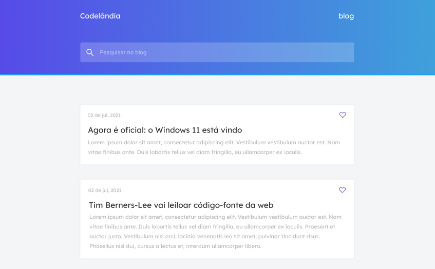

<h1>
    <a href="https://github.com/MatheusXG/Projeto_Blog_Codelandia"></img></a>
</h1>

<h1 align="left" style="font-family: Segoe UI; font-weight: bold; font-size:24px">🛰️ Tecnologias</h1>

Esse projeto foi desenvolvido com as seguintes tecnologias:

<ul>
    <li><a style="font-family: Segoe UI; font-size: 17px; "href="https://pt-br.reactjs.org/">ReactJS</a></li>
    <li><a style="font-family: Segoe UI; font-size: 17px"href="https://getbootstrap.com/">Bootstrap</a></li>
</ul>

<h1 align="left" style="font-family: Segoe UI; font-weight: bold; font-size:24px">🖥️ Projeto</h1>

O projeto faz parte do desafio da codelândia idealizado por iuricode, que consiste em codar o protótipo proposto de um blog de notícias.

<h1 align="left" style="font-family: Segoe UI; font-weight: bold; font-size:24px">📐 Layout</h1>

Você pode visualizar o layout do projeto através desse <a href="https://www.figma.com/file/Yb9IBH56g7T1hdIyZ3BMNO/Desafios---Codel%C3%A2ndia?node-id=0%3A1">link</a>. É necessário ter conta no <a href="https://www.figma.com">Figma</a> para acessá-lo.

<h1 align="left" style="font-family: Segoe UI; font-weight: bold; font-size:24px">🚀 Como executar</h1>

Clone o projeto e acesse a pasta do mesmo.

<pre align="left" style="font-family: Consolas; font-size: regular; ">
$ git clone https://github.com/MatheusXG/Projeto_Blog_Codelandia.git
$ <code style="color: #79C0FF" >cd</code> Projeto_Blog_Codelandia
</pre>

Para iniciar o frontend da aplicação, siga os passos abaixo:

<ul>
    <li style="font-family: Segoe UI; font-size: 16px" >Entre na pasta do frontend da aplicação: <code style="background: #79C0FF; border-radius: 15px;">cd frontend</code></li>
    <li style="font-family: Segoe UI; font-size: 16px" >Instale as depêndencias com: <code style="background: #79C0FF; border-radius: 15px;">npm install</code> ou <code style="background: #79C0FF; border-radius: 15px;">yarn install</code></li>
    <li style="font-family: Segoe UI; font-size: 16px" >Execute o frontend com: <code style="background: #79C0FF; border-radius: 15px;">npm start</code> ou <code style="background: #79C0FF; border-radius: 15px;">yarn start</code></li>
</ul>
 

<h1 align="left" style="font-family: Segoe UI; font-weight: bold; font-size:24px">🧑‍💻 Developer</h1>
<ul>
    <li style="font-family: Segoe UI; font-size: 20px" >👨🏼‍💻 Matheus Xavier Godois</li>
    
<a href="https://github.com/MatheusXG/">🔥 github</a>

    
</ul>